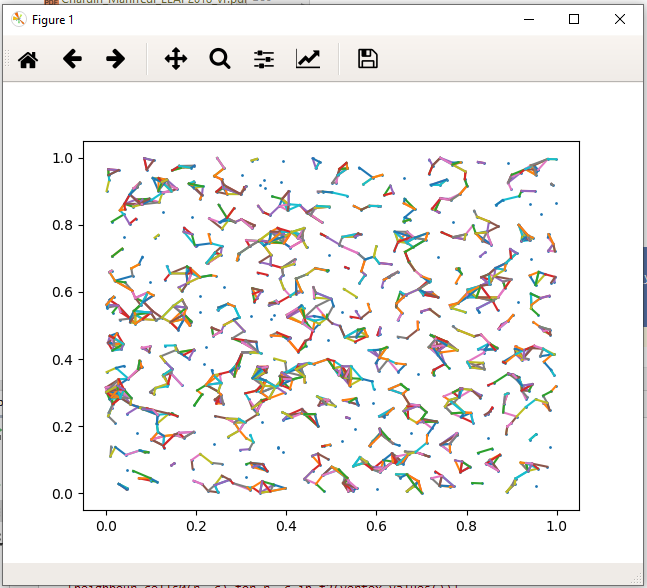

# GraphX
Studies about Graph management, Pregel, Spark, Frames

Construct graph
===============

Grid
----
We split the space as a square grid of cells (currently: 100 x 100)

Vertices
--------
Vertices are created randomly, and a position (x, y) is assigned to them
Then we compute the cells

    conf.g = 100
    cell_id = lambda x, y: int(x*conf.g) + conf.g * int(y*conf.g)

We partition vertices against cell ids (300 partitions)

Edges
-----
**Edges are created first using an edge_iterator**:

* for all vertices:
  * select a random # of connected vertices from all vertices (up to ``max_degree``)
  * ignore self edges
* join [*source vertices, edges, dest vertices*]:
  * source vertex ``src.id == edge.src``
  * dest vertex ``dest.id == edge.dst``
  * source vertex ``src.id != dest.id``
  * source vertex cell is neighbour of dest vertex cell

**cell neighbours**:

two cells are said neighbours when:
* when they are adjacent by sides, ***or*** by corners
* including a continuous spheric space (left-right ***and*** top-down)

Other strategy for creating edges
---------------------------------

We use the mapPartition mechanism to visit partitions

* we divide the space in a matrix (grid) of cells
* we assume that the connection beteen objects will exist only when
  objects are close enough to each other, ie. up to a maximum distance
* in fact, we construct the cell matrix so as the cell size = the max distance
* thus, each object may only be associated with objects found
  in the same cell ***or*** in immediate neighbour cells
  (neighbours by sides or by corners)
* we create a "cell_iterator" able to visit all immediate neighbour
  cells around a given cell
* we define a (lambda) function able to visit all cells plus all
  neighbour cells of all visited cells

        visit_cells = lambda x: [(src_id, x, y, cell, row, col) for i in x]

        # visit all neighbour cells for each cell,
        #
        f2 = lambda x: [[(src_id, x, y, cell_src, _row * grid_size + _col) 
                            for _, _row, _col in cell_iterator(_row, _col, 2, grid_size)] 
                            for src_id, x, y, cell_src, _row, _col in visit_cells(x)]

* to operate the visit, we apply mapPartitions to the vertices,
  and construct the complete list of visited cells and make a dataframe

        def func(p_list):
            yield p_list
            
        vertices_rdd = vertices.rdd.mapPartitions(func)
        full_visit = vertices_rdd.map(lambda x: f2(x))
        all_visited_cells = full_visit.flatMap(lambda x: x).flatMap(lambda x: x)
        all_edges = sqlContext.createDataFrame(all_visited_cells, ['src_id', 'src_cell', 'src_x', 'src_y', 'dst_cell'])

* Then this list of edges is filled with objects using a join by the dest vertices (adding an edge id)
  considering that a sample

            df = all_edges.join(dst, (dst.dst_cell == all_edges.dst_cell) &
                                (all_edges.src_id != dst.dst_id)).\
                select('src_id', 'dst_id'). \
                withColumnRenamed("src_id", "src"). \
                withColumnRenamed("dst_id", "dst"). \
                withColumn('id', monotonically_increasing_id())

* optionally, we may limit the max degree by make the dest dataframe a sample

        dst = vertices. \
            withColumnRenamed("id", "dst_id"). \
            withColumnRenamed("cell", "dst_cell"). \
            withColumnRenamed("x", "dst_x"). \
            withColumnRenamed("y", "dst_y"). \
            sample(False, fraction)

        degree = np.random.randint(0, degree_max)
        fraction = float(degree) / N
        dst = vertices.sample(False, fraction)

* this operation may also performed by batches by hashing the cell id of the source cell

            df = all_edges.join(dst, ((all_edges.src_cell % batches) == batch) &
                                (dst.dst_cell == all_edges.dst_cell) &
                                (all_edges.src_id != dst.dst_id)).\
                select('src_id', 'dst_id'). \
                withColumnRenamed("src_id", "src"). \
                withColumnRenamed("dst_id", "dst"). \
                withColumn('id', monotonically_increasing_id())

* Of course we also improve the edge construction by considering the
  real distance between objects.

            df = all_edges.join(dst, ((all_edges.src_cell % batches) == batch) &
                                (dst.dst_cell == all_edges.dst_cell) &
                                (all_edges.src_id != dst.dst_id) &
                                (dist(src.x, src.y, dst.x, dst.y) < max_distance)).\
                select('src_id', 'dst_id'). \
                withColumnRenamed("src_id", "src"). \
                withColumnRenamed("dst_id", "dst"). \
                withColumn('id', monotonically_increasing_id())

To check the algorithm we make a graphical representation

        points = vertices.toPandas()
        x_points = points["x"]
        y_points = points["y"]
        
        edges = df.toPandas()
        e_src_x = edges["src_x"]
        e_src_y = edges["src_y"]
        e_dst_x = edges["dst_x"]
        e_dst_y = edges["dst_y"]
        
        plt.scatter(x_points, y_points, s=1)
        e = [plt.plot((e_src_x[i], e_dst_x[i]), (e_src_y[i], e_dst_y[i])) for i, x in enumerate(e_src_x)]
        plt.show()

Batch management
----------------
Construction of large set of vertices and edges can be split in batches

* subset dataframes are created
* written (append mode) to hdfs(parquet)

Iterative batch management
--------------------------

The batch management is meant to cope with limited memory in some complex operations that implies large shuffle or aggregations.

Sometimes it's difficult to figure out or foresee the real memory needs (for instance, when the operation is hidden in a library)

The following pattern helps:
- we assume that the full set is keyed by a complete identifying value
- first we split the full set of elements in the dataframe (using some filtering technique on the key)

  - ``subset_size = int(full_size / batches)``
  - construct subsets using filter with condition ``int(key/subset_size) == batch``

- we iterate onto the serie
- we apply the aggregation operation onto each subset

  - if we detect memory error, we increase (x2) the batch number (= we lower the subset size)
  - we adapt the batch number (x2)
  - we re-apply the same iteration with the new conditions

- this pattern may be saved at any step by saving the intermediate results and conditions and restarted later on

example for the triangle count operation:

    batches = conf.batches_for_triangles
    total_triangles = conf.count_at_restart
    batch = conf.batch_at_restart
    full_set = 10000

    subset = int(full_set / batches)
    while batch < batches:
        try:
            gc.collect()
            g1 = g.filterVertices("int(cell/{}) == {}".format(subset, batch))
            triangles = g1.triangleCount()
            gc.collect()
            triangle_count = triangles.agg({"cell":"sum"}).toPandas()["sum(cell)"][0]
            total_triangles += triangle_count
            print("batch=", batch, "total=", total_triangles, "partial", triangle_count)
            batch += 1
        except:
            print("memory error")
            batches *= 2
            batch *= 2
            subset = int(full_set / batches)
            print("restarting with batches=", batches, "subset=", subset, "at batch=", batch)
            if batches >= 1:
                continue
            break

Results
-------

1) Varying the number of vertices and the max-degree for edges (and batches for edges)

<table>
<thead>
<td>vertices</td>
<td>v_batches</td>
<td>V time</td>
<td>max_degree</td>
<td>e_batches</td>
<td>edges</td>
<td>total time</td>
<td>degree</td>
<td>triangles</td>
</thead>
<tr>
<td>1000</td>
<td>1</td>
<td>0h0m13.305s</td>
<td>100</td>
<td>1</td>
<td>14</td>
<td>0h0m10.283s</td>
<td>0h0m7.969s</td>
<td>0h0m5.313s</td>
</tr>
<tr>
<td>10000</td>
<td>10</td>
<td>0h0m54.576s</td>
<td>1000</td>
<td>10</td>
<td>1452</td>
<td>0h3m35.159s</td>
<td>0h0m7.735s</td>
<td>0h0m8.823s</td>
</tr>
<tr>
<td>100000</td>
<td>10</td>
<td>0h0m57.864s</td>
<td>1000</td>
<td>200</td>
<td>14749</td>
<td>0h42m32.747s</td>
<td>0h0m17.488s</td>
<td>0h0m31.310s</td>
</tr>
<tr>
<td>1000000</td>
<td>10</td>
<td>0h1m27.007s</td>
<td>1000</td>
<td>100</td>
<td>147045</td>
<td>4h33h24.873s</td>
<td>0h0m10.379s</td>
<td>0h0m47.097s</td>
</tr>
<tr>
<td>1000000</td>
<td>10</td>
<td>0h1m30.198s</td>
<td>1000</td>
<td>200</td>
<td>147003</td>
<td>4h47h24.070s</td>
<td>0h0m10.183s</td>
<td>0h0m26.816s</td>
</tr>
<tr>
<td>1000000</td>
<td>10</td>
<td>0h1m22.462s</td>
<td>10000</td>
<td>500</td>
<td>1470306</td>
<td>46h2h52.120s</td>
<td>0h0m19.660s</td>
<td>0h0m49.222s</td>
</tr>
</table>

2) Varying the number of edge-batches (same number of vertices [1000000] and degree[10000])

<table>
<thead>
<td>max_degree</td>
<td>e_batches</td>
<td>time per edge batch</td>
<td>total time</td>
</thead>
<tr>
<td>10000</td>
<td>500</td>
<td>5m</td>
<td>40h</td>
</tr>
<tr>
<td>10000</td>
<td>200</td>
<td>12m</td>
<td>42h</td>
</tr>
<tr>
<td>10000</td>
<td>100</td>
<td>27m</td>
<td>45h</td>
</tr>
<tr>
<td>20000</td>
<td>500</td>
<td>5m50</td>
<td>48h</td>
</tr>
</table>

3. Varying the number of vertices and the max-degree for edges (and batches for edges)

complete change in the strategy for the join (see the paragraph above)

<table>
<thead>
<td>workers</td>
<td>vertices</td>
<td>v_batches</td>
<td>V time</td>
<td>max_degree</td>
<td>e_batches</td>
<td>edges</td>
<td>E time</td>
<td>write time</td>
<td>degree</td>
<td>triangles</td>
<td># triangles</td>
</thead>
<tr>
<td>4</td>
<td>1000</td>
<td>10</td>
<td>0h0m1.491s</td>
<td>1000</td>
<td>1</td>
<td>1566</td>
<td>0h0m1.491s</td>
<td>0h0m11.733s</td>
<td>0h0m9.657s</td>
<td>0h0m43.663s</td>
<td>4912218</td>
</tr>
<tr>
<td>4</td>
<td>10 000</td>
<td>10</td>
<td>0h0m46.351s</td>
<td>10 000</td>
<td>1</td>
<td>15 452</td>
<td>0h0m1.551s</td>
<td>0h0m19.689s</td>
<td>0h0m11.036s</td>
<td>0h4m45.836s</td>
<td>50214139</td>
</tr>
<tr>
<td>4</td>
<td>100 000</td>
<td>10</td>
<td>0h0m49.201s</td>
<td>100 000</td>
<td>1</td>
<td>3 921 357</td>
<td>0h0m1.735s</td>
<td>0h0m24.630s</td>
<td>0h0m59.007s</td>
<td>0h51m41.582s</td>
<td>499196623</td>
</tr>
<tr>
<td>4</td>
<td>1000 000</td>
<td>10</td>
<td>0h1m24.758s</td>
<td>1000 000</td>
<td>1</td>
<td>428 932 503</td>
<td>0h0m1.918s</td>
<td>0h0m45.455s</td>
<td></td>
<td>3h26m40.596s</td>
<td>5001347193</td>
</tr>
<tr>
<td>8</td>
<td>1000 000</td>
<td>10</td>
<td>0h1m24.758s</td>
<td>1000 000</td>
<td>1</td>
<td>428 932 503</td>
<td>0h0m1.918s</td>
<td>0h0m45.455s</td>
<td></td>
<td>0h19m13.099s</td>
<td>5001347193</td>
</tr>
<tr>
<td>4</td>
<td>10 000 000</td>
<td>10</td>
<td>0h6m56.625s</td>
<td>10 000 000</td>
<td>1</td>
<td>22 874 329 457</td>
<td>0h0m2.784s</td>
<td>0h17m27.193s</td>
<td></td>
<td>4h54h42.640s</td>
<td>49987572968</td>
</tr>
<tr>
<td>4</td>
<td>100 000 000</td>
<td>50</td>
<td>1h6h44.922s</td>
<td>1000 000</td>
<td>100</td>
<td>49 848 057 868</td>
<td></td>
<td>2h7h28.941s</td>
<td></td>
<td>27h43h40.575s</td>
<td>499 928 450 413</td>
</tr>
</table>

GraphFrame
----------
Once vertices and edges are created, graphframes are assembled

Using graphs
============
A second application read vertex and edge dataframes and re-assemble graphframes and apply algorithms

